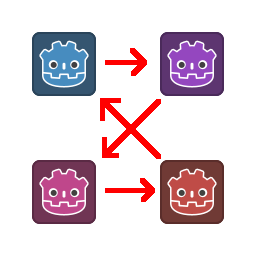
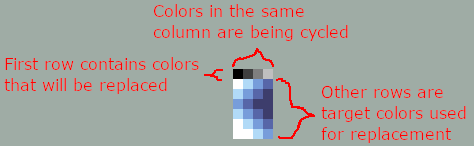
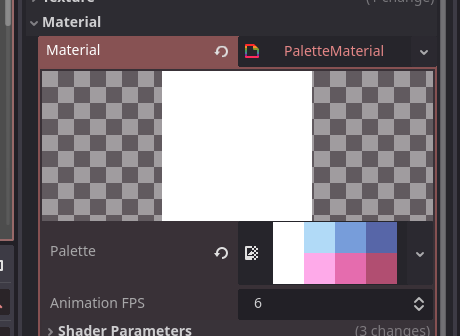
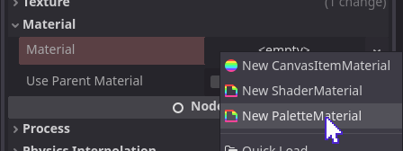
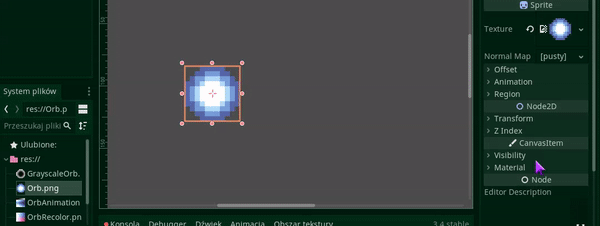

#  Godot Palette Swap Shader

This shader allows for remapping colors based on a provided palette. It's like your standard palette-swap, except it's easy to setup and supports animation.

It comes in 2 versions: Palette Material and Legacy Shader. Palette Material is a new version of the shader, which is much more optimized, but more limited. Legacy Shader is the older version that has bigger color limit, longer animation support and some extra options, but it's slower.

The shader comes with an addon that you need to enable in Project Settings.

## Common

### Palette format

The palette is divided in columns and rows.

The top row are "reference colors". The shader will replace these colors from the original with the other colors in subsequent rows.

Note: Be sure to set `texture_filter` on the node with material to Nearest.

### Animation

The shader has basic animation support. It will cycle through the rows of the assigned palette, based on the `fps` parameter. Let's consider this image:

And this palette:

The first row are the grayscale reference colors from the image, the other rows are colors for animation. The result is this:

The number of rows determine animation length. If there are only 2 rows (reference and target), the animation is disabled.

## Palette Material

The addons comes with a new Material type called `PaletteMaterial`.

It has 2 properties: `palette` and `animation_fps`.

`palette` is the image palette as described above. The material will automatically select shader based on the palette. If it has 2 rows, the animation is disabled, so the shader is simplified. The material bakes palette colors into arrays, to avoid texture lookup. It does it by setting the shader parameters, so you shouldn't modify them manually.

`animation_fps` is the FPS value when animation is enabled (i.e. palette has more than 2 rows).

### Usage

Just assign PaletteMaterial to any CanvasItem node and assign a palette.

### Limitations

The palette supports only up to 256 reference colors. It also supports only up to 256 target colors, even when animation is enabled, thus number of reference colors also determines maximum length of the animation.

The shader directly reads and writes COLOR, to avoid any texture lookups. In Godot 4 COLOR also includes `modulate`, so if you modulate your sprite, it will affect the shader (the reference colors will be modulated).

Unlike Legacy Shader, Palette Material completely ignores alpha channel. Final color will use source alpha. Also it has no support for including the first row in the animation; the first row is always reference colors only. If you want to use them in the animation, you need to repeat it.

## Legacy Shader

The Legacy Shader supports any palette size (but Godot imports only up to 16k). Number of rows doesn't matter, but having too many columns will have impact on performance. It's fast enough to have tens of them, but hundreds/thousands might be problematic (I didn't test exact numbers, but I guess no one will use such big palette. Hopefully).

The shader will directly use the palette (without baking values) and ignore `modulate` property of the node.

### Basic usage

The shader is called `LegacyPaletteSwap.gdshader`.

1. Assign the shader to your Sprite or any other CanvasItem node. You can either create a ShaderMaterial and do a Quick Load, or drag the file into material property.
2. Put a palette into the shader params.

### Parameters

- `skip_first_row`: If disabled, the first row of palette will also be used for animation. In case of the above example, the orb would have one grayscale frame.
- `use_palette_alpha`: If enabled, the output color will also use the alpha value from the palette. Normally the alpha is ignored and uses the source alpha.
- `fps`: Frames per second, or more like, rows per second in the animation.
- `palette`: The palette image.

## Other

### Example Project

The shader comes with an example project. Check SwappingExample.tscn and LegacySwappingExample.tscn for example usage. When installing the addon into your project, remember to exclude the ExampleProject folder and `project.godot`.

### Palette generator

The asset comes with a palette generator. It's a tool that will automatically generate a palette template for the selected texture. It checks every pixel for unique colors and puts them in the reference row, and adds a second empty row. It's recommended that the image does not have many unique colors, as the palette could get very big.

To use it, go to Project -> Tools -> Generate Palette...

You will have to pick the source image and then resulting palette file. The generator supports loading all image formats supported by Godot. The palette is always saved as WebP.

### Technical details

The shader uses for loop to compare pixels. The colors are first converted to integer, so the comparison is faster and perfectly accurate. I optimized the code and there is only one `if` that will branch if your source image has colors that won't be replaced. The shader should be pretty fast, but I didn't test performance limits.

The improved shader avoids any texture lookups, so it should be a lot of faster than the legacy shader. I didn't benchmark it either though.

___
You can find all my addons on my [profile page](https://github.com/KoBeWi).

